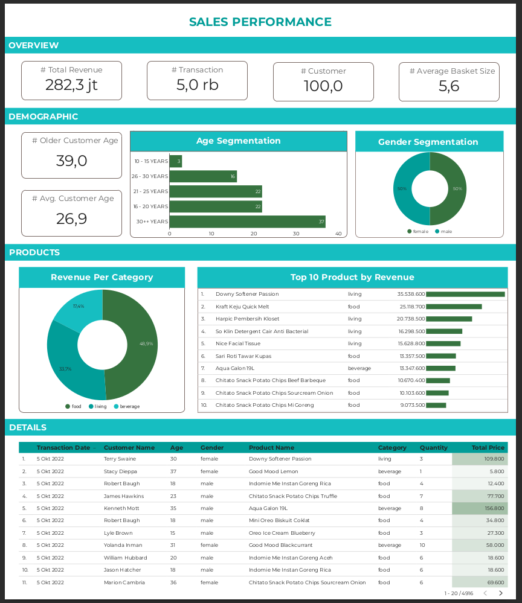

<h1 align="center">
  
</h1>

<h2 align="center">Business Intelligence Dashboard Project</h2>

 Business Intelligence roles are included in the scope of work of a data engineer, so as a data engineer at least we can present a good vizualisation. Here, i was challenged by Digitalskola to create a sales report dashboard. So I made a simple dashboard from the data provided, in the process it is possible to make queries in Google Data Studio so that it makes work easier. This is the <code><a href="https://datastudio.google.com/reporting/ae13ed2a-1def-4b51-92bd-e5b6be27f504">Dashboard</a></code> that I made, if you want to know please click it

